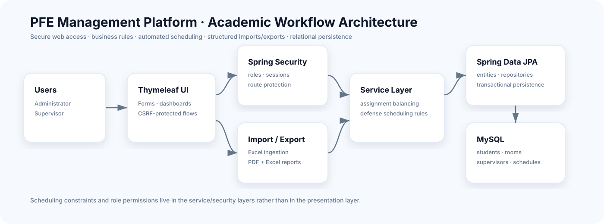

<div align="center">

# PFE Management Platform

### Secure academic workflow for final-year project assignment & defense scheduling

**Spring Boot · Spring Security · JPA · MySQL · automated scheduling · Excel/PDF workflows**


</div>

A Spring Boot web application that centralizes **students, supervisors, rooms, PFE allocation, defense scheduling constraints, structured imports/exports and role-based access**.

> Academic project co-developed by Chaima Menouar and a colleague. This repository is the maintained portfolio edition; see [`CONTRIBUTORS.md`](CONTRIBUTORS.md) for available attribution.

## Architecture



The platform follows a layered architecture: protected Thymeleaf interfaces → controllers → business services → Spring Data JPA → MySQL, with import/export workflows kept as dedicated concerns.

## Core features

- student, supervisor and room management;
- Excel import for GI, ID and TDIA tracks;
- automatic and balanced supervisor assignment;
- automated defense scheduling with conflict checks;
- configurable dates, time slots, breaks and daily capacity;
- PDF and Excel report generation;
- separate administrator and supervisor workspaces;
- publication of schedules and department assignments;
- server-side validation, CSRF protection and file-upload controls.

## Engineering stack

| Layer | Technology |
|---|---|
| Backend | Java 17 · Spring Boot 4 · Spring MVC |
| Security | Spring Security · CSRF · role-based access |
| Persistence | Spring Data JPA · MySQL 8 |
| UI | Thymeleaf |
| Imports/exports | Apache POI · OpenPDF |
| Testing | JUnit 5 · Spring Test · H2 |
| Build | Maven Wrapper · GitHub Actions |

## Quick start

### Prerequisites

- JDK 17+
- Docker Desktop or a local MySQL 8 instance

```bash
cp .env.example .env
docker compose up -d db
```

Linux/macOS:

```bash
set -a
. ./.env
set +a
./mvnw spring-boot:run
```

Windows PowerShell:

```powershell
$env:DB_PASSWORD="your-database-password"
$env:APP_ADMIN_PASSWORD="your-admin-password"
.\mvnw.cmd spring-boot:run
```

Open `http://localhost:8080`.

## Scheduling & assignment logic

The service layer handles:

- balanced supervisor allocation;
- defense-room and time-slot constraints;
- conflict prevention;
- configurable capacity and breaks;
- publication workflows.

Keeping these rules outside the UI makes them easier to test and evolve.

## Excel formats

Accepted formats: `.xlsx` and `.xls`, maximum 5 MB per file.

### Student import

```text
CNE | NOM | PRENOM | EMAIL PERSONNEL | EMAIL ACADEMIQUE
```

Track is inferred from source filename (`GI`, `ID`, `TDIA`).

### Supervisor import

```text
Row 1: Encadrant | [empty] | Discipline
Row 2: Nom       | Prénom  | [empty]
Next rows: Nom | Prénom | Discipline
```

## Testing

```bash
./mvnw verify
```

Automated tests use H2 in memory, so MySQL is not required for the test suite. GitHub Actions runs verification on pushes and pull requests targeting the main branches.

## Security notes

- no real database password or production admin account is committed;
- mutating operations use `POST` with CSRF protection;
- real student/staff data must never be published;
- production deployment would still require TLS, backups, controlled migrations, centralized secrets and a full security review.

## Project value

This project demonstrates **enterprise-style CRUD workflows, scheduling logic, role-based access, structured imports/exports, testing and relational persistence** in one coherent academic management system.

## Attribution

No open-source license is granted by this repository. Reuse or redistribution must respect the rights of the project contributors.
