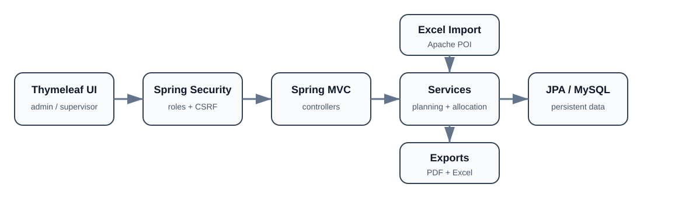

# PFE Management Platform

A Spring Boot web application for managing final-year project assignments and defense scheduling for Computer Engineering tracks. The platform centralizes students, supervisors, rooms, PFE allocation, scheduling constraints, imports, exports, and role-based access.

> Academic project co-developed by Chaima Menouar and a colleague. This repository is the maintained portfolio edition; see [`CONTRIBUTORS.md`](CONTRIBUTORS.md) for available attribution.

## Architecture



The application follows a layered Spring architecture: Thymeleaf interfaces are protected by Spring Security, controllers delegate business rules to services, and persistence is handled through Spring Data JPA and MySQL. Excel import and PDF/Excel export are kept as dedicated workflow concerns.

## Core features

- student, supervisor, and room management;
- multi-file Excel import for GI, ID, and TDIA tracks;
- automatic and balanced supervisor assignment;
- automatic defense scheduling with conflict checks;
- configurable dates, time slots, breaks, and daily capacity;
- PDF and Excel report generation;
- separate administrator and supervisor workspaces;
- publication of scheduling and department assignments;
- validation, CSRF protection, and file-upload controls.

## Technology stack

- Java 17
- Spring Boot 4
- Spring MVC
- Spring Security
- Spring Data JPA
- Thymeleaf
- MySQL 8
- Apache POI
- OpenPDF
- Maven Wrapper
- JUnit 5
- Spring Test / Spring Security Test
- H2 for automated tests

## Quick start

### Prerequisites

- JDK 17+
- Docker Desktop, or a local MySQL 8 instance

Copy the local environment template:

```bash
cp .env.example .env
```

Set your own database and administrator passwords. The initial administrator password must contain at least 12 characters.

Start MySQL with Docker:

```bash
docker compose up -d db
```

Then run the application on Linux/macOS:

```bash
set -a
. ./.env
set +a
./mvnw spring-boot:run
```

On Windows PowerShell:

```powershell
$env:DB_PASSWORD="your-database-password"
$env:APP_ADMIN_PASSWORD="your-admin-password"
.\mvnw.cmd spring-boot:run
```

Open `http://localhost:8080`.

## Supervisor accounts

When an administrator creates or edits a supervisor account:

- the login identifier is the supervisor email address;
- the password must contain at least 12 characters;
- leaving the password blank during an edit preserves the existing password;
- disabling the supervisor also disables the associated account.

Supervisors imported from Excel do not automatically receive a password; the administrator can set one from the supervisor record.

## Excel formats

Accepted formats: `.xlsx` and `.xls`, with a 5 MB maximum per file.

### Student import

```text
CNE | NOM | PRENOM | EMAIL PERSONNEL | EMAIL ACADEMIQUE
```

The track is inferred from the source filename (`GI`, `ID`, or `TDIA`).

### Supervisor import

```text
Row 1: Encadrant | [empty] | Discipline
Row 2: Nom       | Prénom  | [empty]
Next rows: Nom | Prénom | Discipline
```

## Testing

```bash
./mvnw verify
```

Automated tests use H2 in memory, so a MySQL instance is not required for the test suite. GitHub Actions runs verification on pushes and pull requests targeting the main branches.

## Configuration

| Variable | Required | Default | Purpose |
|---|---:|---|---|
| `DB_URL` | No | local `gestion_pfe` MySQL URL | JDBC connection |
| `DB_USERNAME` | No | `root` | MySQL user |
| `DB_PASSWORD` | Effectively yes | empty | MySQL password |
| `APP_ADMIN_USERNAME` | No | `admin` | initial administrator username |
| `APP_ADMIN_PASSWORD` | Yes on first run | none | initial administrator password |
| `SERVER_PORT` | No | `8080` | HTTP port |
| `JPA_DDL_AUTO` | No | `update` | Hibernate schema strategy |
| `THYMELEAF_CACHE` | No | `true` | template caching |

## Security and data handling

The repository does not include a real database password or predefined production administrator account. Mutating operations use `POST` and CSRF protection. Real student or staff data must never be published in a public repository.

Before any public production deployment, add TLS, backups, controlled database migrations, centralized secrets management, and a full security review.

## Project context

The project demonstrates enterprise-style CRUD workflows, scheduling logic, role-based web access, structured imports/exports, testing, and relational persistence in one academic management platform.

## Attribution

No open-source license is granted by this repository. Reuse or redistribution must respect the rights of the project contributors.
