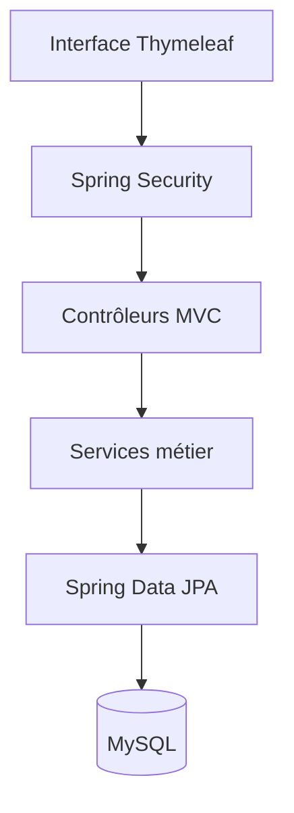

# Gestion PFE — planification des soutenances

Application web Spring Boot destinée à gérer les étudiants, les encadrants, les salles, l'affectation des PFE et la planification des soutenances du département Informatique (GI, ID et TDIA).

> Projet académique co-développé par Chaima Menouar et un collègue. Chaima maintient cette édition du portfolio. Voir [CONTRIBUTORS.md](CONTRIBUTORS.md) pour l'attribution complète disponible.

[Voir la démonstration vidéo](https://drive.google.com/file/d/1OoESFjzgxFUNzq6oq4bNtkI0T47ILiz6/view?usp=sharing)

## Fonctionnalités

- gestion des étudiants, enseignants et salles ;
- import Excel multi-fichiers pour les filières GI, ID et TDIA ;
- affectation automatique et équilibrée des encadrants ;
- planification automatique des soutenances avec contrôle des conflits ;
- paramétrage des dates, horaires, pauses et capacités journalières ;
- génération de rapports PDF et Excel ;
- espace administrateur et espace encadrant séparés par rôle ;
- publication du planning et de la répartition par département ;
- validation des données, protection CSRF et contrôle des fichiers importés.

## Architecture



## Stack technique

- Java 17
- Spring Boot 4
- Spring MVC, Spring Security et Spring Data JPA
- Thymeleaf
- MySQL 8
- Apache POI pour Excel
- OpenPDF pour les exports PDF
- Maven Wrapper
- JUnit 5, Spring Test, Spring Security Test et H2

## Prérequis

- JDK 17 ou plus récent
- Docker Desktop **ou** une instance MySQL 8 locale

Le Maven Wrapper télécharge Maven automatiquement au premier lancement.

## Démarrage rapide

1. Copier la configuration locale :

   ```bash
   cp .env.example .env
   ```

2. Modifier `.env` et remplacer les deux mots de passe d'exemple. Le mot de passe administrateur doit contenir au moins 12 caractères.

3. Démarrer MySQL :

   ```bash
   docker compose up -d db
   ```

4. Charger les variables et lancer l'application sous Linux/macOS :

   ```bash
   set -a
   . ./.env
   set +a
   ./mvnw spring-boot:run
   ```

   Sous Windows PowerShell, définir au minimum :

   ```powershell
   $env:DB_PASSWORD="votre-mot-de-passe-base"
   $env:APP_ADMIN_PASSWORD="votre-mot-de-passe-admin"
   .\mvnw.cmd spring-boot:run
   ```

5. Ouvrir [http://localhost:8080](http://localhost:8080), puis se connecter avec `APP_ADMIN_USERNAME` et `APP_ADMIN_PASSWORD`.

Le premier démarrage crée l'administrateur et trois salles de démonstration. Aucun mot de passe réel n'est stocké dans le dépôt.

### Sans Docker

Créer une base MySQL nommée `gestion_pfe`, puis définir :

```bash
export DB_URL='jdbc:mysql://localhost:3306/gestion_pfe?useSSL=false&allowPublicKeyRetrieval=true&serverTimezone=UTC'
export DB_USERNAME='root'
export DB_PASSWORD='votre-mot-de-passe-base'
export APP_ADMIN_PASSWORD='votre-mot-de-passe-admin'
./mvnw spring-boot:run
```

## Comptes encadrants

Lors de l'ajout ou de la modification d'un enseignant, l'administrateur peut renseigner un mot de passe de compte encadrant :

- l'identifiant est l'adresse email de l'enseignant ;
- le mot de passe doit contenir au moins 12 caractères ;
- laisser le champ vide lors d'une modification conserve le mot de passe existant ;
- désactiver l'enseignant désactive également son compte.

Les enseignants importés depuis Excel n'ont pas automatiquement de mot de passe. L'administrateur peut ouvrir leur fiche et en définir un.

## Formats Excel

Les fichiers `.xlsx` et `.xls` sont acceptés, avec une taille maximale de 5 Mo par fichier.

### Étudiants

```text
CNE | NOM | PRENOM | EMAIL PERSONNEL | EMAIL ACADEMIQUE
```

La filière est détectée depuis le nom du fichier (`GI`, `ID` ou `TDIA`).

### Enseignants

```text
Ligne 1 : Encadrant | [vide] | Discipline
Ligne 2 : Nom       | Prénom | [vide]
Lignes suivantes : Nom | Prénom | Discipline
```

## Tests

```bash
./mvnw verify
```

Les tests utilisent H2 en mémoire : aucune base MySQL n'est nécessaire. Le workflow GitHub Actions exécute automatiquement la vérification sur chaque pull request et chaque push vers `main` ou `master`.

## Configuration

| Variable | Obligatoire | Valeur par défaut | Description |
|---|---:|---|---|
| `DB_URL` | Non | MySQL local `gestion_pfe` | URL JDBC |
| `DB_USERNAME` | Non | `root` | Utilisateur MySQL |
| `DB_PASSWORD` | Oui en pratique | vide | Mot de passe MySQL |
| `APP_ADMIN_USERNAME` | Non | `admin` | Premier compte administrateur |
| `APP_ADMIN_PASSWORD` | Oui au premier démarrage | aucune | Mot de passe initial, 12 caractères minimum |
| `SERVER_PORT` | Non | `8080` | Port HTTP |
| `JPA_DDL_AUTO` | Non | `update` | Stratégie Hibernate |
| `THYMELEAF_CACHE` | Non | `true` | Cache des templates |

## Sécurité et données

Le dépôt ne contient ni mot de passe de base de données ni compte administrateur prédéfini. Les opérations qui modifient les données utilisent `POST` et sont protégées par CSRF. Ne jamais publier de vraies données d'étudiants ou d'enseignants dans un dépôt public.

Pour un déploiement public, consulter [SECURITY.md](SECURITY.md) et ajouter TLS, sauvegardes, migrations de base de données et gestion centralisée des secrets.

## Licence et attribution

Aucune licence open source n'est accordée avec cette copie. Le projet reste attribué à ses co-développeurs ; toute réutilisation ou redistribution doit respecter leurs droits et leur accord.
